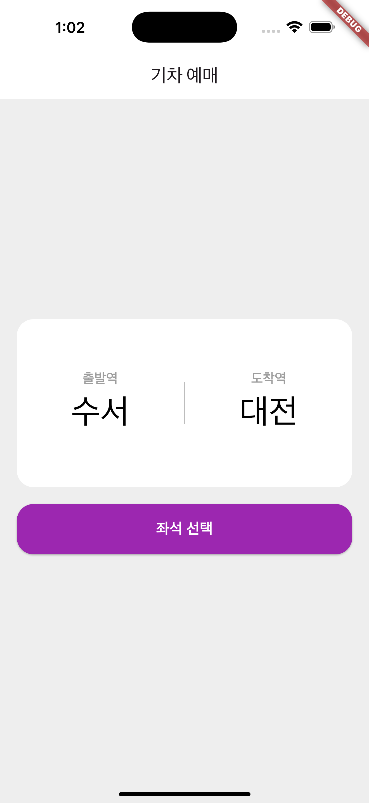
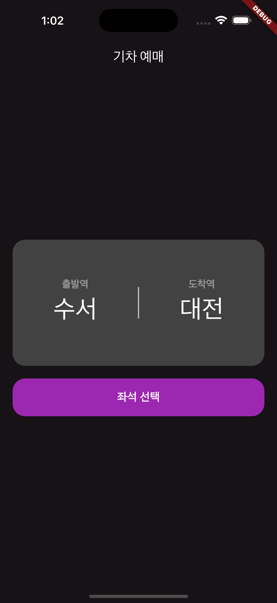

# Flutter 기차 예매 어플

## 📣 프로젝트 개요

기차의 출발역과 도착역 그리고 좌석을 선택하기까지의 과정을 담은 어플

 

## 📆 프로젝트 일정

25/03/26 ~ 25/04/01

 

## 📑 주요 기능

> - 사용자의 **시스템 테마에 따라 UI의 색상을 변경**할 수 있다.
> - **상태 관리를 통해** 출발역과 도착역을 선택하여 **UI를 동적으로 변경**할 수 있다.
> - **상태 관리를 통해** 좌석을 선택 및 해제가 가능하며 **선택한 좌석이 없을 경우에는 예매 버튼이 비활성화된다.**
> - Navigator위젯을 통해 **라우팅**을 할 수 있다.

 

    

    

 

## 🚨 TroubleShooting

> <a href="https://skyhyunjinlee.tistory.com/entry/TIL-018-Flutter%EB%A1%9C-%EA%B8%B0%EC%B0%A8-%EC%A2%8C%EC%84%9D-%EC%98%88%EB%A7%A4-%EC%96%B4%ED%94%8C-%EB%A7%8C%EB%93%A4%EA%B8%B0-1" target="_blank">뒤로 가기를 할 경우 데이터 받는 방법</a>
>
> `문제상황` :

- 위젯 트리가 성립되지 않는 서로 다른 페이지에서 이전 페이지에 데이터를 주고 받는 방법을 모르는 상황

`해결과정` :

1. `Navigator.push()`에 `await`키워드를 사용하여 해결

 

> <a href="https://skyhyunjinlee.tistory.com/entry/TIL-020-Flutter%EB%A1%9C-%EA%B8%B0%EC%B0%A8-%EC%A2%8C%EC%84%9D-%EC%98%88%EB%A7%A4-%EC%96%B4%ED%94%8C-%EB%A7%8C%EB%93%A4%EA%B8%B0-2" target="_blank">ListView위젯을 사용할 때 발생하는 문제</a>
>
> `문제상황` :

- 좌석의 개수가 많으므로 스크롤을 생성하기 위해 `ListView`위젯을 사용했으나 에러가 발생

`해결과정` :

1. 에러의 내용 중 `hasSize`라는 단어를 보고 제한 된 크기와 무한한 크기에 관련된 문제라고 추측
2. `ListView`의 크기를 제한하기 위해 `Expanded`위젯을 부모 요소를 사용하여 해결

 

## 💻 발전 시킬 부분

- [ ] 비동기로 서버와 통신을 하는 기능
- [ ] 비동기 처리를 하면서 예외 처리를 하는 기능
